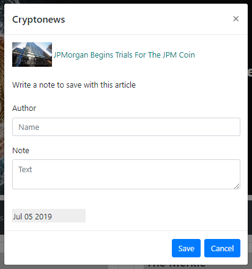

# Cryptonews
## All the weeks crytocurrency news in one place!
 
View project on heroku at https://vast-anchorage-63071.herokuapp.com/
       
 

## Instructions

Cryptonews is a one stop shop for timely cryptocurrency news.  

On startup the app scarpes the major crypto websites and news outlets for the latest cryptocurency news stories and presents a concise summary of each news articles, grouped by source,  for immediate review. From the homepage the user may requst more news from a particular source using the navbar menu or search for news from all the outlets with a search term of their choice, try 'bitcoin'! 
   
Cryptocoin users can click on an article to read or save the article to their saved articles list to read later using the buttons to the right of each article summary. saved artocles can be viewed at any time right from the homepage. 

Attach a note to each saved article by filing out the saved note dialog which appears whenever an article is saved. 

   
   
Here, users may enter their name and a note on the article. Clicking 'Save' saves the note to selected article to the database along with the associated note. Leaving the fields blank will create a blank note that can be written to at a later date if required. 

On the saved articles page, users have the option to read the article in full, delete the article from the saved list or to view any associated note. 
   
  
Notes to view appear in the right-side panel along with options to edit the content of the note or clear the contents. If there is no  note assocaited with the article, the user is informed and given the option to add a an associated note. 

   
   
Whenever a saved article summary is displayed, there will be the option to view, edit or clear its assocated note, and both articles and notes are stored permanently on a remote database.

### The application uses: ###
  
1. Node.js
2. Express.js
3. Handlebars 
4. MongoDB 
5. Mongoose 

and demonstrates:
  
6. model-view-controller organisation
7. use of cheerio for efficient web scraping
8. use of a nosql, document oriented database (MongoDB)
9. deployment to Heroku
 
### NPM Packages ###

1. npm install express 
2. npm install mongo
3. npm install body-parser
4. npm install method-override
5. npm install axios
6. npm install cheerio
7. npm install express-handlebars
8. npm install morgan

## License

[MIT license](LICENSE.txt)
